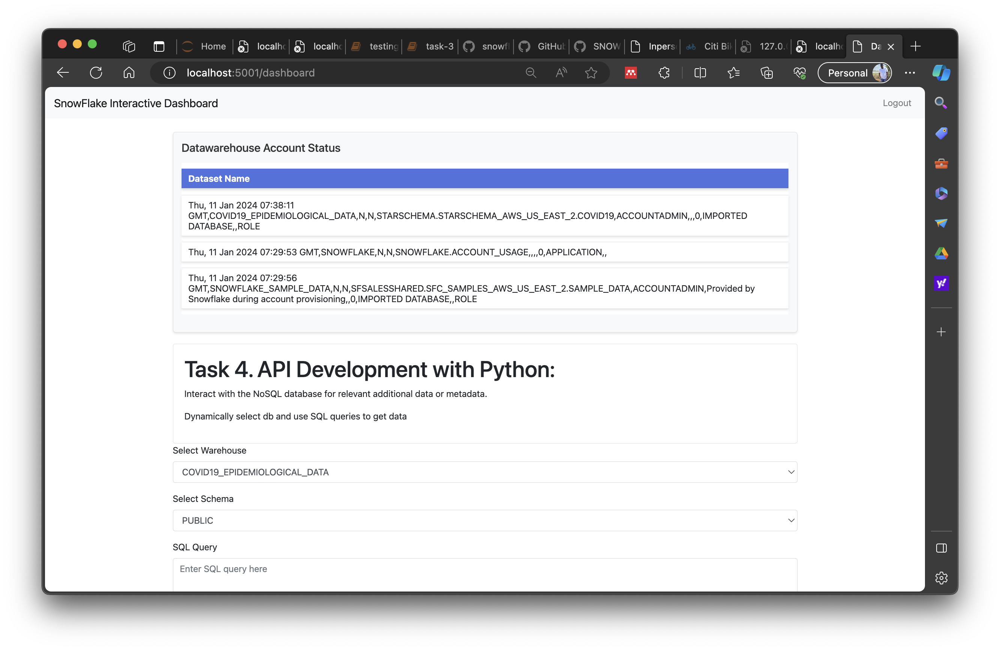

# btcamp_final_prject

Final Project API

working application dir = finalProjectAPI
This repository houses the code for the final API, developed using the Flask framework. Additionally, I've explored the initialization of the FastAPI framework, and details for that are also included.
Report - https://github.com/mewanmadusha/btcamp_final_project/blob/main/bootcamp_final_project_PothumullaKankanamge_MewanMadhusha.pdf

Docker:
A Docker image for the application is available. To pull and run it, use the following commands:

docker image URL = https://hub.docker.com/r/jetskymewan/finalproject

docker run -d -p 5001:5000 jetskymewan/finalproject:1.0.0

Thank you

